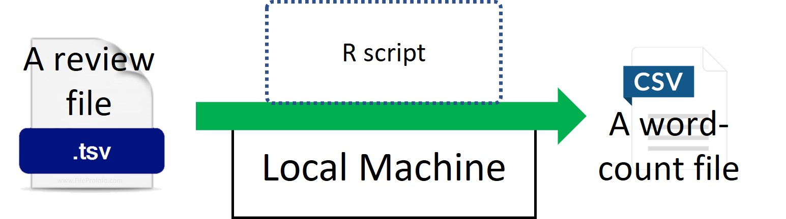
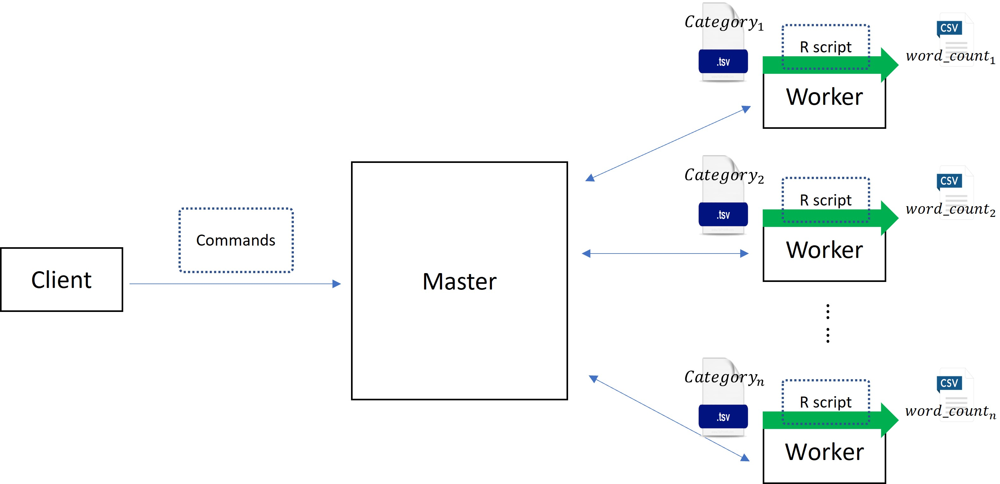

# I. Introduction
|        In a period of over two decades since the first review in 1995, millions of Amazon customers have contributed over a hundred million reviews to express opinions and describe their experiences regarding products on the Amazon.com website. Our dataset is the collection of reviews written in the Amazon.com marketplace and associated metadata from 1995 until 2015. And we are particularly interested in the star ratings and the review body. The question we want to address is “What are the populars words in reviews for each Amazon category?” To solve this problem, we used a local machine to analyze one category and broadcast our results to all categories by CHTC. 

# II. Body
## A. Data
|        This is a list of data with more than 34,000 consumer reviews for Amazon products like the Kindle, Fire TV Stick, and more provided by Datafiniti's Product Database. Each line in the data files corresponds to an individual review. The dataset includes basic product information, rating, review text, and more for each product. The size of the whole dataset is about 50 GB, and it contains many smaller dataset divided by product category. And we set stop words to filter out some meaningless words to clean the review text.

## B. Statistical Computation
### 1. For a single category
|        We expand each review_body into word vector, then filter out meaningless words by the default stop words in the tidytext package. After that, we count the number of appearances of each term. Finally, we output the top 10 terms to a csv file.



### 2. For all categories
|        We broadcast our single analysis flow to all categories by CHTC. As the figure 2 shows, we let each worker in the distributed system perform the computational steps in the figure1. So, we will get n’s word count files. Each file is corresponding to a specific category and contains the top 10 terms appeared most frequently in that category. 



|        Also, the number of jobs, runtime for each job, memory and disk space required are listed in the following table.

```{r echo=FALSE, warning=FALSE}
library(knitr)
library(readr)
```

```{r echo=FALSE, results='asis'}
a <- data.frame("Number of Jobs"=c(NA), 'Runtime'=c(NA), "Memeory"=c(NA), "Disk Space"=c(NA))
kable(a, caption="CHTC Info")
```


|        Note: Since we are still working on the CHTC issues, we will fill out this table after resolving the issues. 

## C. Result
For demonstration, we pick one category to explain.
```{r echo=FALSE}
bady <- read_csv("word_summary1.csv",col_types=cols())
kable(data.frame(bady), caption="Top 10 Terms for Bady Category")
```


|        In the above table, we display the terms appear most frequently in the bady category. The mean_rating is the average ratings of the reviews with the specific terms. The score is the  AFINN lexicon score. The count_word is the times specific terms appear in the reviews.     
	
|        Note: We use local machine to produced the above table. In the final report, we will have plenty of tables ***generated by CHTC***. 
# III. Conclusion
|        So far, we have analyzed the most popular words in reviews on Amazon for the Baby products and we found that “love”, “recommend”, “perfect”, and so on are used most frequently in this category reviews. For the following steps, we will broadcast our results to more data to analyze the reviews for more categories.

# IV. Github Link
https://github.com/hxiao128/STAT605-GroupProject4  
